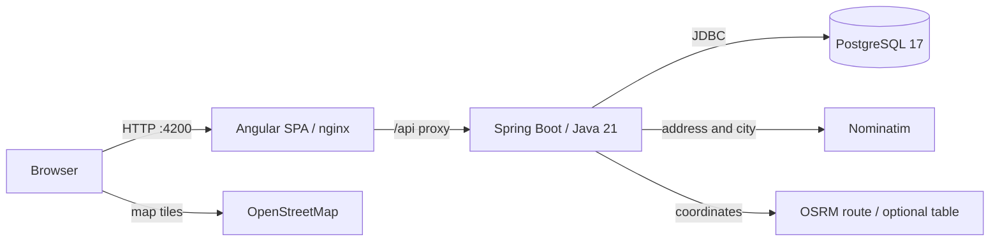
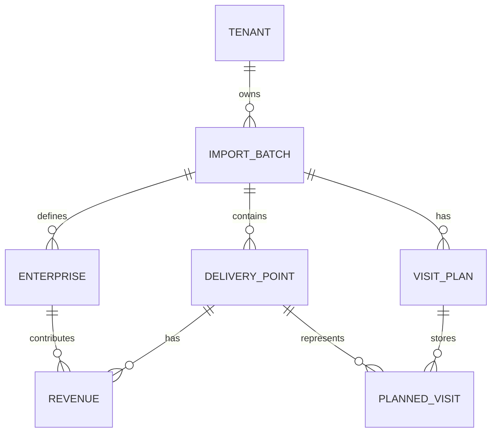

# Software Architecture

Implemented structure, reviewed against source and deployment configuration on 2026-09-29.
VisitWise imports yearly Excel revenue, maps delivery points and plans sales visits for a tenant.

## Runtime and deployment

| Service | Implementation | Host port / state |
|---|---|---|
| `frontend` | Angular 22, spartan/ui, Tailwind 4, OpenLayers; nginx | `4200:80`; static SPA |
| `backend` | Spring Boot 4.1.1, Java 21, Maven; POI, JPA, Security | `127.0.0.1:8080`; in-memory sessions |
| `db` | PostgreSQL 17 Alpine; Liquibase schema | `5432`; `visitwise-db-data` volume |
| `osrm-data` | Optional `osrm` profile, OSRM v6 car/CH preprocessing | Prepares central Italy extract in `visitwise-osrm-data` |
| `osrm` | Optional local road route/table server | `127.0.0.1:5000`; reuses prepared volume |

Deployment is defined by [Compose](../../source/docker-compose.yml), Dockerfiles and [application settings](../../source/backend/src/main/resources/application.yml).
Compose starts frontend, backend and database by default. Local Angular development proxies `/api` to the backend.
The OSRM profile alone does not change the backend URL: set `ROUTING_BASE_URL=http://osrm:5000` and `ROUTING_MATRIX_ENABLED=true` for road-based planning in Compose.
Without those settings, planning uses estimates; day-route display defaults to the public OSRM service.

## Backend boundaries

Feature packages live under `it.teamlab.visitwise`; controllers return DTOs rather than JPA entities.

| Package | Responsibility |
|---|---|
| `imports` | Excel preview/mapping, transactional import, list/detail/delete |
| `geocoding` | Background jobs, Nominatim client, shared cache, retry and manual coordinates |
| `analytics` | Delivery-point read API, filtered KPIs, breakdowns and Pareto |
| `planning` | API DTOs, persistence, engine adapter and OSRM providers |
| `planning.engine` | Pure Java calendar, campaigns, constraints and deterministic heuristic |
| `planning.export` | XLSX generation from stored visits |
| `tenant` | Registration, session/remember-me login, profile/base and tenant isolation |
| `common` | Exceptions translated to problem+json |

The engine has no Spring, JPA or network dependency; the service supplies optional road matrices.

## Main flows

1. Preview reads headers/sample rows without saving. Import validates the mapping and saves points, enterprises and revenues in one transaction, using batched inserts.
2. Missing coordinates trigger geocoding after commit. The worker caches successes/misses, resumes interrupted `GEOCODING` imports at startup, and exposes progress for UI polling.
3. The geocoder defaults to 1100 ms between provider calls. Completion sets `READY`; a provider interruption also sets `READY`, with an error message and unresolved points available for retry.
4. Simulation loads current import data, optionally obtains a road matrix, then invokes the engine. What-if reuses loaded data/matrix across horizons.
5. Save recomputes and writes parameters, KPIs and visits. List uses stored summaries; detail recomputes from saved parameters and current data; export reads stored visits.
6. The displayed day's road polyline is a separate route request, with an estimate fallback. It does not update the plan's KPIs.

## Data model

- `tenant` combines federation, credentials, lockout metadata and an optional starting base; one shared account per federation.
- `persistent_logins` stores remember-me series/tokens keyed by email; `geocode_cache` is shared across imports and tenants.
- Enterprises are rows scoped to an import; there is no separate tenant-wide enterprise registry.
- `import_batch.tenant_id` anchors ownership. Foreign-key cascades remove dependent data when an import is deleted.
- Mapping, plan parameters and KPIs are JSON stored in text columns. [Liquibase changesets](../../source/backend/src/main/resources/db/changelog/changes) own the schema; Hibernate only validates it.

## Frontend and security

- Lazy routes: `/login`, `/register`, `/profile`, `/imports`, `/imports/new`, `/imports/:importId`, and its `/map`, `/planner`, `/scenarios`, `/plans/:planId` children.
- `core` holds auth, theme and shared API models; `features` holds pages/services; `shared` holds maps, charts and reusable views; `libs/ui` holds Helm components.
- Angular signals and reactive forms drive the UI; charts use local SVG/CSS and maps use OpenLayers with OSM tiles.
- Auth guards protect pages; Spring Security protects the API. `TenantGuardFilter` checks import/plan ownership and hides foreign ids with `404`.
- Session cookies are HttpOnly/SameSite=Lax; CSRF uses Angular's cookie/header convention. Remember-me tokens persist across backend restarts.
- nginx supplies CSP and other browser headers; its `connect-src 'self'` keeps application API calls on the same origin.
- Nominatim receives addresses/cities; OSRM receives coordinates; OSM receives tile requests and coordinates when the user opens directions. Customer names and revenues are not sent to these providers.

Details: [API contract](API_CONTRACT.md), [authentication](AUTHENTICATION.md), [planner](OPTIMIZATION_STRATEGY.md), [decisions](DECISIONS.md).
