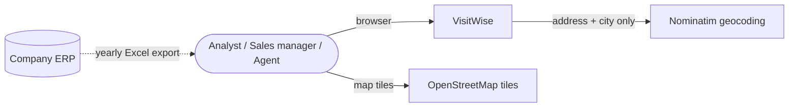
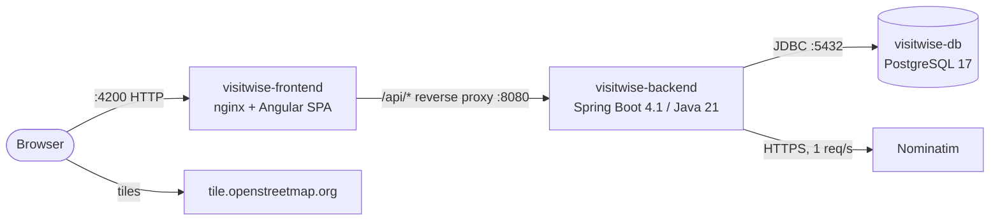
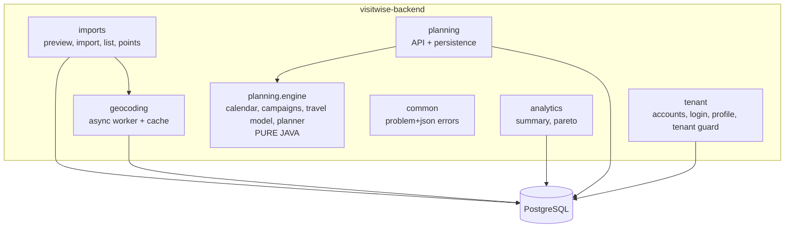
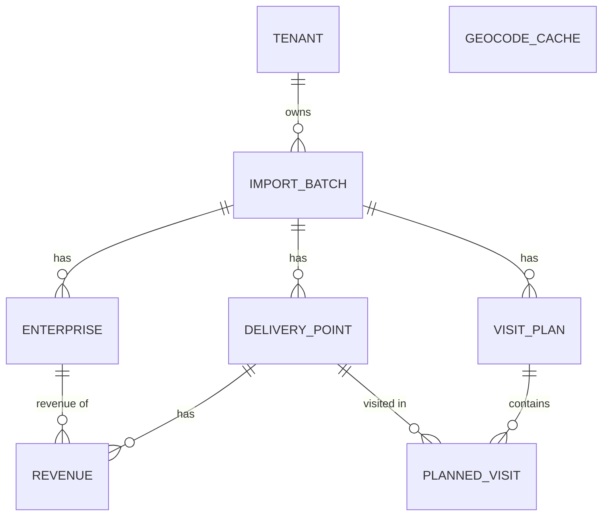

# Software Architecture

> Owner: Rivera (coordinator). Everyone updates the part they change. Diagrams are Mermaid (rendered by GitHub) - export PNGs to `../slides/assets/` for the deck.

## 1. Context



## 2. Containers (docker compose)



| Container | Image / build | Port (host:container) | State |
|---|---|---|---|
| visitwise-frontend | `source/frontend/Dockerfile` (node build -> nginx) | 4200:80 | stateless |
| visitwise-backend | `source/backend/Dockerfile` (maven build -> JRE) | 127.0.0.1:8080:8080 (this machine only) | login sessions in memory |
| visitwise-db | `postgres:17-alpine` | 5432:5432 | volume `visitwise-db-data` |

Infrastructure as Code: `source/docker-compose.yml` + Dockerfiles + Liquibase changelog + GitHub Actions CI (`.github/workflows/ci.yml`). A fresh machine needs only Docker.

## 3. Backend components



Key flows

1. **Import**: `POST /imports/preview` (parse headers, suggest mapping) -> `POST /imports` (parse with mapping, save rows, status `GEOCODING`) -> background geocoder fills coordinates 1 req/s (cache first) -> status `READY`. The UI polls the detail endpoint.
2. **Plan**: `POST /plans/simulate` loads the import's points, builds visit targets, runs the engine, returns the plan (nothing saved). `POST /plans` does the same and persists `visit_plan` + `planned_visit`. `POST /plans/what-if` runs the engine for N horizons.

## 4. Data model



- Enterprises are **data, not columns**: any number of companies per import (the file is parametric).
- `geocode_cache` is global: next year's file re-uses all known addresses.
- Deleting an import cascades to everything (FK `ON DELETE CASCADE`); deleting a tenant deletes its imports.
- `tenant` is both the federation and its only login (email + Argon2id hash). `import_batch.tenant_id` is the only tenant column: everything else hangs off the import.
- Schema source: `source/backend/src/main/resources/db/changelog/`.

## 5. Security (details: `AUTHENTICATION.md`, decisions D-09, D-10)

- **Login**: one account per tenant; Spring Security form login, server session in an HttpOnly SameSite=Lax cookie (30 min idle), CSRF token in the `XSRF-TOKEN` cookie sent back by Angular `HttpClient`. Every `/api` call needs a session except register, login, csrf, health, API docs.
- **Passwords**: 8-64 characters (minimum configurable, `PASSWORD_MIN_LENGTH`), NFKC, Argon2id (OWASP parameters); failed logins lock the account from the 5th attempt (1 min doubling to 15 min); login, register and password change limited per client IP.
- **Tenant isolation**: `TenantGuardFilter` checks every URL under `/api/imports/{id}` and `/api/plans/{id}` before any controller; another tenant's id answers the same 404 as a missing one.
- **Browser**: nginx sends a Content Security Policy (`script-src 'self'`, map tiles only from `tile.openstreetmap.org`), `Referrer-Policy`, `Permissions-Policy`, `X-Frame-Options`, `nosniff`; the API is published on `127.0.0.1` only, users go through nginx.

## 6. Frontend structure

```
src/app/
  core/models/api.models.ts   # contract mirror (single source of API types)
  features/imports/           # Puccetti: wizard, list, detail
  features/dashboard/         # Rivera: map dashboard
  features/planner/           # Marzella: planner, what-if, scenarios
  features/plans/             # Rivera: agent plan (calendar, export, directions)
  shared/                     # Rivera: presentational components (KPI card, legend, MapView, ...)
```

Routes (all lazy): `/imports`, `/imports/new`, `/imports/:importId`, `/imports/:importId/map`, `/imports/:importId/planner`, `/imports/:importId/scenarios`, `/imports/:importId/plans/:planId`.

## 7. Technology choices (summary - details in DECISIONS.md)

| Concern | Choice | Why |
|---|---|---|
| Backend | Spring Boot 4.1, Java 21, Maven | Team stack; mature ecosystem (POI, JPA, Liquibase) |
| DB | PostgreSQL 17 + Liquibase | Relational data; versioned, reproducible schema |
| Frontend | Angular 22 + spartan-ng + Tailwind | Team stack; accessible headless components |
| Map | OpenLayers + OSM | Required; free; no API key |
| Geocoding | Nominatim + DB cache | Free, OSM-consistent; cache respects usage policy |
| Planner | Custom deterministic heuristic | See OPTIMIZATION_STRATEGY.md |
| Deploy | Docker Compose | IaC, one command on any platform |
